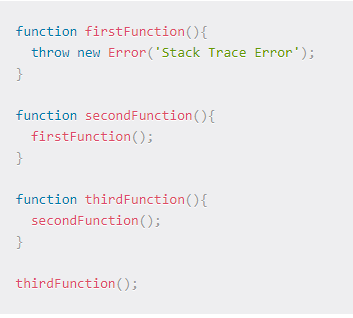
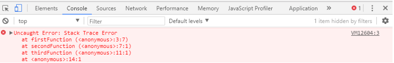
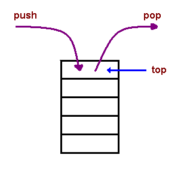
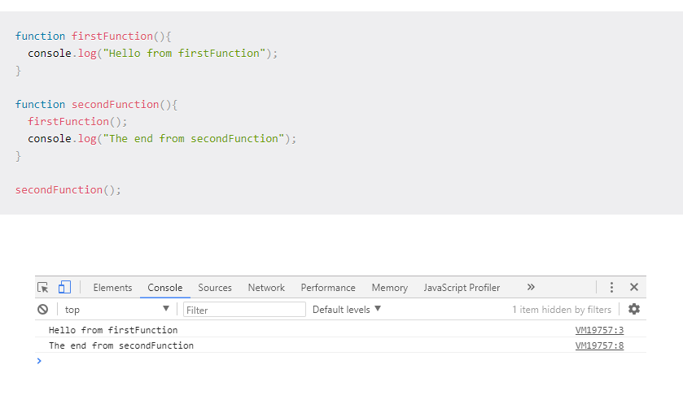
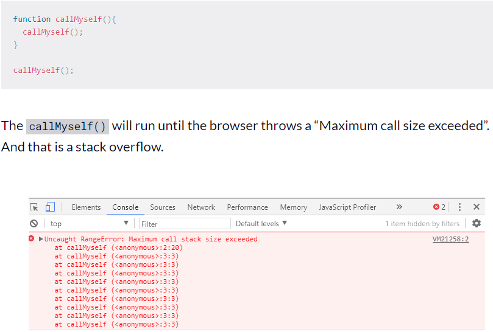
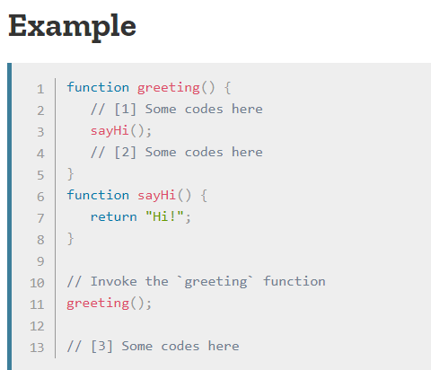
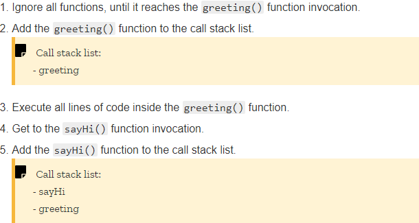
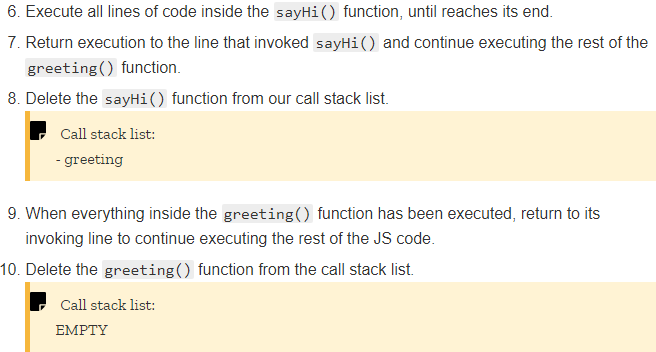

# The JavaScript Call Stack

The call stack is primarily used for function invocation (call). Since the call stack is single, function(s) execution, is done, one at a time, from top to bottom. It means the call stack is synchronous.The understanding of the call stack is vital to Asynchronous programming
At the most basic level, a call stack is a data structure that uses the Last In, First Out (LIFO) principle to temporarily store and manage function invocation (call).

**LIFO:** When we say that the call stack, operates by the data structure principle of Last In, First Out, it means that the last function that gets pushed into the stack is the first to be pop out, when the function returns.

Let us take a look at a code sample to demonstrate LIFO by printing a stack trace error to the console.

ou will notice that the arrangement of the functions as a stack begins with the firstFunction() (which is the last function that got into the stack, and is popped out to throw the error), followed by the secondFunction(), and then the thirdFunction() (which is the first function that gets pushed into the stack when the code is executed).

## Temporarily store:
When a function is invoked (called), the function, its parameters, and variables are pushed into the call stack to form a stack frame. This stack frame is a memory location in the stack. The memory is cleared when the function returns as it is pop out of the stack.

## Manage function invocation (call):
The call stack maintains a record of the position of each stack frame. It knows the next function to be executed (and will remove it after execution). This is what makes code execution in JavaScript synchronous.Think of yourself standing on a queue, in a grocery store cash point. You can only be attended to after the person in front of you have been attended to.

# How does the call stack handle function calls?
We will answer this question by looking at a sample code of a function that calls another function. 

This is what happens when the code is run:

1. When secondFunction() gets executed, an empty stack frame is created. It is the main (anonymous) entry point of the program.
2. secondFunction() then calls firstFunction()which is pushed into the stack.
3. firstFunction() returns and prints “Hello from firstFunction” to the console.
4. firstFunction() is pop off the stack.
5. The execution order then move to secondFunction().
6. secondFunction() returns and print “The end from secondFunction” to the console.
7. secondFunction() is pop off the stack, clearing the memory.

# What causes a stack overflow?
A stack overflow occurs when there is a recursive function (a function that calls itself) without an exit point. The browser (hosting environment) has a maximum stack call that it can accomodate before throwing a stack error.

# SUMARY 

A call stack is a mechanism for an interpreter (like the JavaScript interpreter in a web browser) to keep track of its place in a script that calls multiple functions — what function is currently being run and what functions are called from within that function.

- When a script calls a function, the interpreter adds it to the call stack and then starts carrying out the function.
- Any functions that are called by that function are added to the call stack further up, and run where their calls are reached.
- When the current function is finished, the interpreter takes it off the stack and resumes execution where it left off in the last code listing.
- If the stack takes up more space than it had assigned to it, it results in a "stack overflow" error.

The code above would be executed like this:

