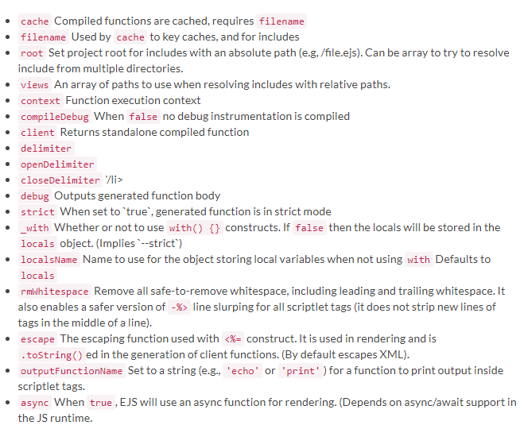
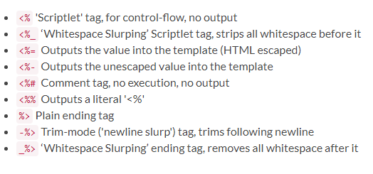
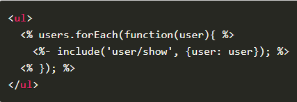
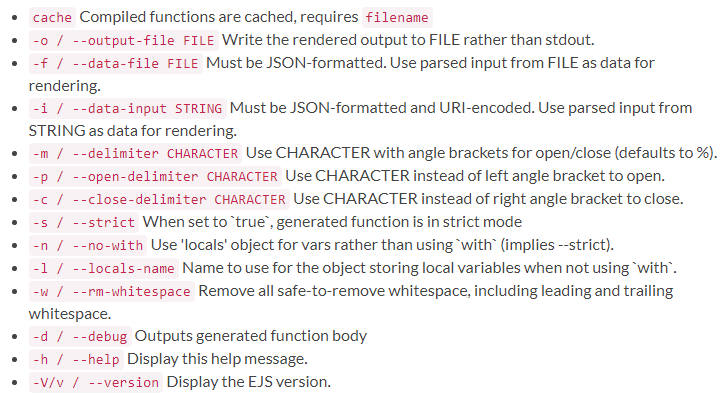
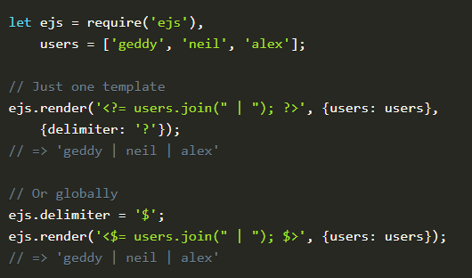
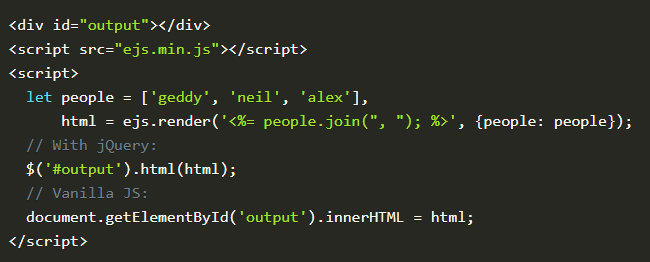

#EJS

# What is EJS?
What is the "E" for? "Embedded?" Could be. How about "Effective," "Elegant," or just "Easy"? 
EJS is a simple templating language that lets you generate HTML markup with plain JavaScript. No religiousness about how to organize things. No reinvention of iteration and control-flow. It's just plain JavaScript.

# Features
1. Fast compilation and rendering
2. Simple template tags: <% %>
3. Custom delimiters (e.g., use [? ?] instead of <% %>)
4. Sub-template includes
5. Ships with CLI
6. Both server JS and browser support
7. Static caching of intermediate JavaScript
8. Static caching of templates
9. Complies with the Express view system

# Install
It's easy to install EJS with NPM.

     $ npm install ejs

# Use
Pass EJS a template string and some data. BOOM, you've got some HTML.

      let ejs = require('ejs');
      let people = ['geddy', 'neil', 'alex'];
      let html = ejs.render('<%= people.join(", "); %>', {people: people});

# CLI
Feed it a template file and a data file, and specify an output file.

      ejs ./template_file.ejs -f data_file.json -o ./output.html

# Browser support
Download a browser build from the latest release, and use it in a script tag.

      
      
      

# Example

     <% if (user) { %>
     <h2><%= user.name %></h2>
     <% } %>

# Usage

      let template = ejs.compile(str, options);
      template(data);
      // => Rendered HTML string

      ejs.render(str, data, options);
      // => Rendered HTML string

    ejs.renderFile(filename, data, options, function(err, str){
    // str => Rendered HTML string
    });

# Options

# Tags

# Includes

Includes are relative to the template with the include call. (This requires the 'filename' option.) For example if you have "./views/users.ejs" and "./views/user/show.ejs" you would use <%- include('user/show'); %>.

You'll likely want to use the raw output tag (<%-) with your include to avoid double-escaping the HTML output.

# CLI

EJS ships with a full-featured command-line interface. Options are similar to those used in JavaScript code:

### Some examples of use:

        $ ejs -p [ -c ] ./template_file.ejs -o ./output.html
        $ ejs ./test/fixtures/user.ejs name=Lerxst
        $ ejs -n -l _ ./some_template.ejs -f ./data_file.json

# Custom delimiters

Custom delimiters can be applied on a per-template basis, or globally:

# Caching

EJS ships with a basic in-process cache for caching the intermediate JavaScript functions used to render templates. It's easy to plug in LRU caching using Node's `lru-cache` library:

        let ejs = require('ejs'),
        LRU = require('lru-cache');
        ejs.cache = LRU(100); // LRU cache with 100-item limit
        
        
If you want to clear the EJS cache, call ejs.clearCache. If you're using the LRU cache and need a different limit, simple reset `ejs.cache` to a new instance of the LRU.

# Layouts

EJS does not specifically support blocks, but layouts can be implemented by including headers and footers, like so:

      <%- include('header'); -%>
      <h1>
          Title
      </h1>
      

          My page
      

      <%- include('footer'); -%>
      
# Client-side support

Go to the latest release, download ./ejs.js or ./ejs.min.js. Alternately, you can compile it yourself by cloning the repository and running jake build (or $(npm bin)/jake build if jake is not installed globally).

Include one of these files on your page, and ejs should be available globally

