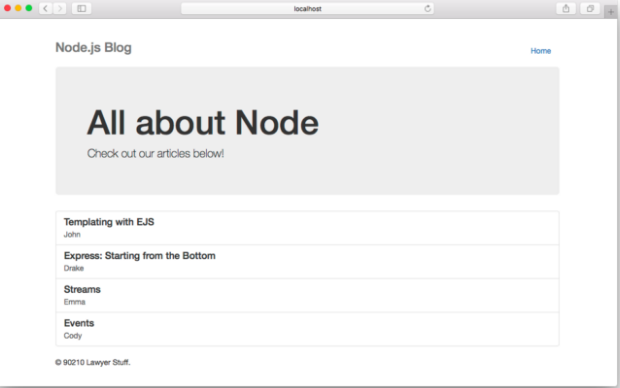
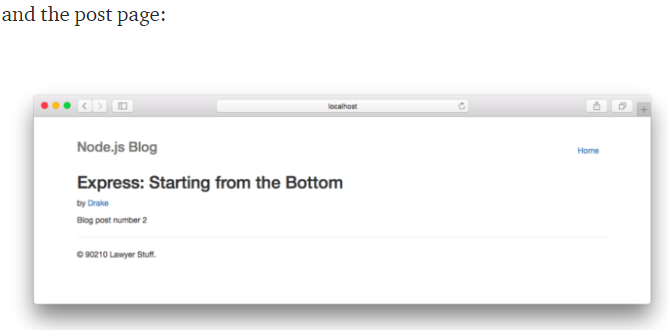
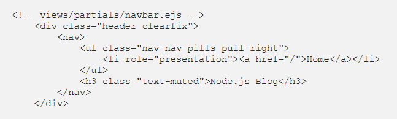
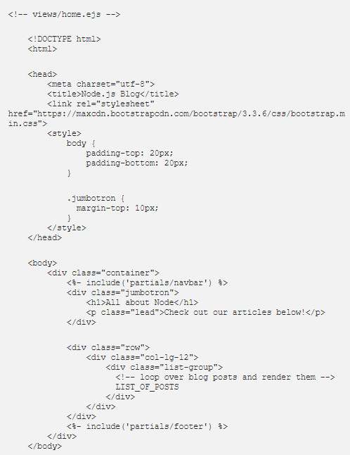
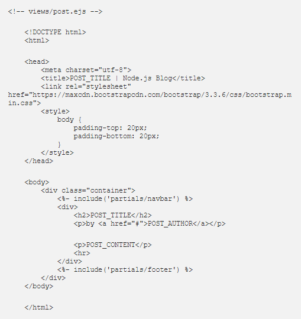

# ENJ

# EJS Partials

Partials come in handy when you want to reuse the same HTML across multiple views.
Think of partials as functions, they make large websites easier to maintain as you don’t have to go and change a piece of text in every page it appears in.
Instead, you define that reusable bundle of code in a file andinclude it wherever you need it.

will consist of a home page which lists all the blog posts and a post page which will display a single post. Our home page will look like so:
The same navigation bar and footer this is perfect candidates for partials!

create those partials. Under the views/partials/ directory create a file callednavbar.ejs which will contain only the HTML for the navigation bar at the top of the home and post pages:

and a file called footer.ejs in that same directory:

          <!-- views/partials/footer.ejs -->
           <footer class="footer">
           
© 90210 Lawyer Stuff.

           </footer>

ow that we have our partials defined, we can use them in our home.ejs and post.ejs templates!
In EJS, any JavaScript or non-HTML syntax you include in your templates is always surrounded by <% %> delimiters

Including a partial in EJS is quite straightforward. You use <%- include( PARTIAL_FILE ) %> where the partial file is relative to the template you use it in.

# Note:
The <%- %> tags allow us to output the unescaped content onto the page (notice the -). This is important when using the include() statement since you don’t want EJS to escape your HTML characters like ‘<’, ‘>’, etc…

This will create the homepage template in views/home.ejs and include the navbar and footer partial

and for the post page in views/post.ejs

As you can see creating and including partials is very straightforward with EJS. 
I’ve intentionally left in some placeholders such as LIST_OF_POSTS, POST_TITLE, POST_AUTHOR, and POST_CONTENT so that we can take a look at how we can pass data from our Node + Express application to our views in the next section.

