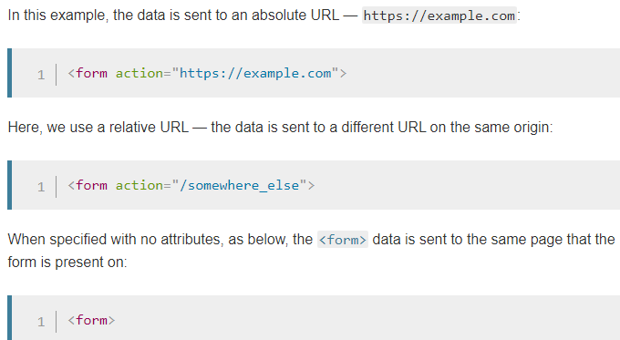
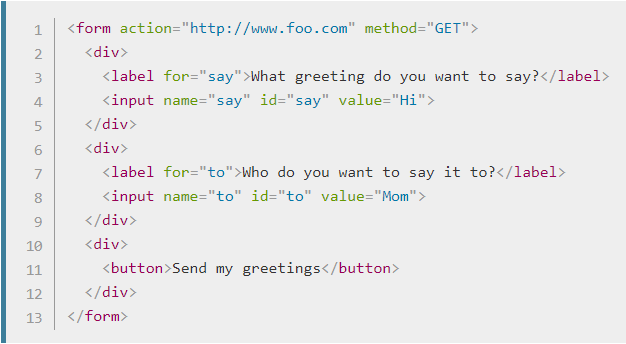
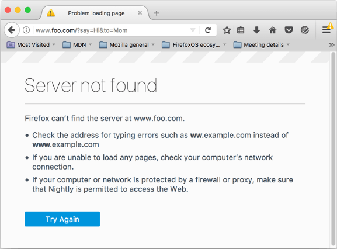
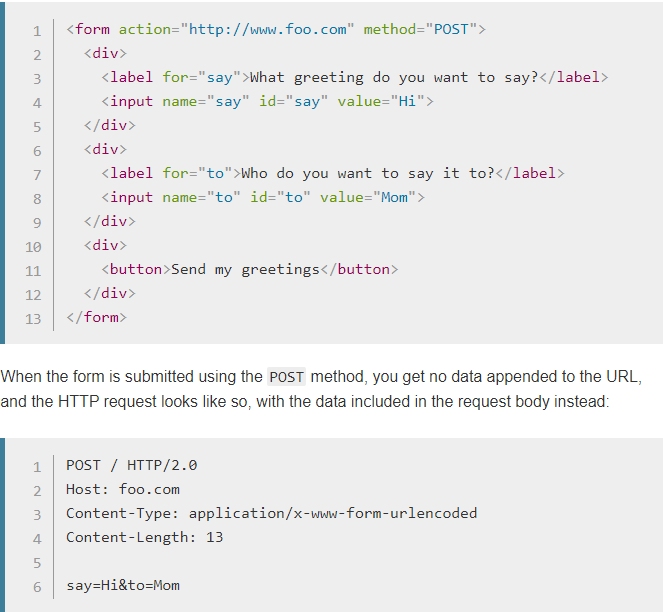
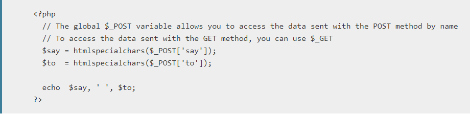
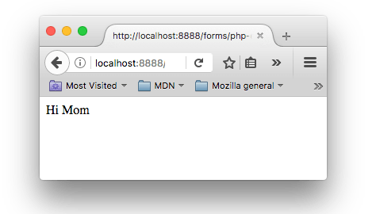

# Update/Delete

# Sending form data

# Client/server architecture

At it's most basic, the web uses a client/server architecture that can be summarized as follows. a client (usually a web browser) sends a request to a server (most of the time a web server like Apache, Nginx, IIS, Tomcat, etc.), using the HTTP protocol. The server answers the request using the same protocol.

An HTML form on a web page is nothing more than a convenient user-friendly way to configure an HTTP request to send data to a server. This enables the user to provide information to be delivered in the HTTP request.

# On the client side: defining how to send the data
The <form> element defines how the data will be sent. All of its attributes are designed to let you configure the request to be sent when a user hits a submit button. The two most important attributes are action and method.

## The action attribute
The action attribute defines where the data gets sent. Its value must be a valid relative or absolute URL. If this attribute isn't provided, the data will be sent to the URL of the page containing the form — the current page.

# Note: 
It's possible to specify a URL that uses the HTTPS (secure HTTP) protocol. When you do this, the data is encrypted along with the rest of the request, even if the form itself is hosted on an insecure page accessed using HTTP. On the other hand, if the form is hosted on a secure page but you specify an insecure HTTP URL with the action attribute, all browsers display a security warning to the user each time they try to send data because the data will not be encrypted.

## The method attribute
The method attribute defines how data is sent. The HTTP protocol provides several ways to perform a request; HTML form data can be transmitted via a number of different methods, the most common being the GET method and the POST method

To understand the difference between those two methods, let's step back and examine how HTTP works. Each time you want to reach a resource on the Web, the browser sends a request to a URL. An HTTP request consists of two parts: a header that contains a set of global metadata about the browser's capabilities, and a body that can contain information necessary for the server to process the specific request.

## The GET method
The GET method is the method used by the browser to ask the server to send back a given resource: "Hey server, I want to get this resource." In this case, the browser sends an empty body. Because the body is empty, if a form is sent using this method the data sent to the server is appended to the URL.

Since the GET method has been used, you'll see the URL www.foo.com/?say=Hi&to=Mom appear in the browser address bar when you submit the form.

The data is appended to the URL as a series of name/value pairs. After the URL web address has ended, we include a question mark (?) followed by the name/value pairs, each one separated by an ampersand (&). In this case we are passing two pieces of data to the server:

- say, which has a value of Hi
- to, which has a value of Mom

## The POST method

The POST method is a little different. It's the method the browser uses to talk to the server when asking for a response that takes into account the data provided in the body of the HTTP request: "Hey server, take a look at this data and send me back an appropriate result." If a form is sent using this method, the data is appended to the body of the HTTP request.

# On the server side: retrieving the data
Whichever HTTP method you choose, the server receives a string that will be parsed in order to get the data as a list of key/value pairs. The way you access this list depends on the development platform you use and on any specific frameworks you may be using with it.

This example displays a page with the data we sent. You can see this in action in our example php-example.html file — which contains the same example form as we saw before, with a method of POST and an action of php-example.php. When it is submitted, it sends the form data to php-example.php, which contains the PHP code seen in the above block. When this code is executed, the output in the browser is Hi Mom.

