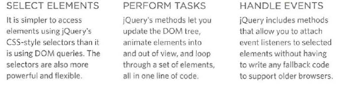
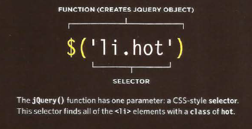
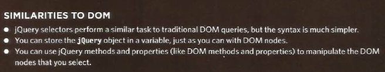
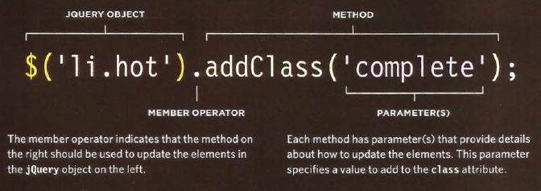
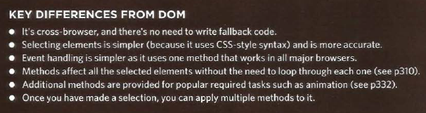
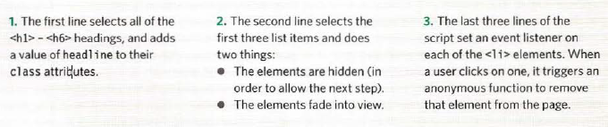
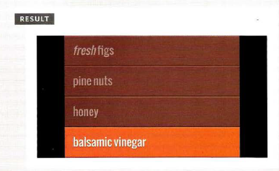

# 6 Reasons for Pair Programming 

  pair programming is the practice of two developers sharing a single workstation to interactively tackle a coding task together. At Code Fellows, pair programing is one way we foster a collaborative environment while developing key industry skills.

   ### How does pair programming work?
   
   Pair programming commonly involves two roles: the Driver and the Navigator. The Driver is the programmer who is typing and the only one whose hands are on the keyboard.
   
   The Navigator uses their words to guide the Driver but does not provide any direct input to the computer. The Navigator thinks about the big picture, what comes next, how an algorithm might be converted in to code, while scanning for typos or bugs. The Navigator might also utilize their computer as a second screen to look up solutions and documentation, but should not be writing any code.
   
   
   ### Why pair program?
   
   1. Greater efficiency
   2. Engaged collaboration
   3. Learning from fellow students
   4. Social skills
   5. Job interview readiness
   6. Work environment readiness

# jQuery 
jQuery offers a simple way to achieve a variety of common JavaScript tasks quickly and consistently, across all major browsers and without any fallback code needed.

## What is jQuery ?
JS file that include in your web pages. Its let you find element using CSS-style sellectorthen do somethings with the element using jQuery methoods.

## Find element using CSS-style 

## Do somthing with gQuery

## Difference with DOM

# Examples :

