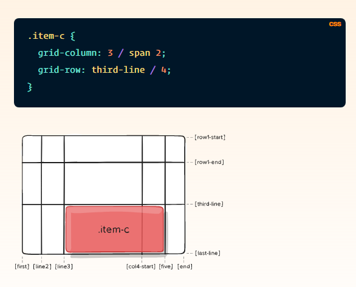

# Grid

**Properties for the Parent (Grid Container)**

## display
Defines the element as a grid container and establishes a new grid formatting context for its contents.

### Values:

**grid** – generates a block-level grid
**inline-grid** – generates an inline-level grid

    .container {
       display: grid | inline-grid;
        }

## grid-template-columns
## grid-template-rows

Defines the columns and rows of the grid with a space-separated list of values. The values represent the track size, and the space between them represents the grid line.

### Values:

**< track-size>** – can be a length, a percentage, or a fraction of the free space in the grid (using the fr unit)
**< line-name>** – an arbitrary name of your choosing

      .container {
             grid-template-columns:  ... |   ...;
             grid-template-rows:  ... |   ...;
                  }
                  
## Example:

     
## grid-template-areas

Defines a grid template by referencing the names of the grid areas which are specified with the grid-area property. Repeating the name of a grid area causes the content to span those cells. A period signifies an empty cell. The syntax itself provides a visualization of the structure of the grid.

### Values:

**< grid-area-name>** – the name of a grid area specified with grid-area
**.** – a period signifies an empty grid cell
**none** – no grid areas are defined

      .item-a {
            grid-area: header;
              }
      .item-b {
            grid-area: main;
              }
      .item-c {
            grid-area: sidebar;
              }
      .item-d {
           grid-area: footer;
              }

      .container {
          display: grid;
          grid-template-columns: 50px 50px 50px 50px;
          grid-template-rows: auto;
          grid-template-areas: 
          "header header header header"
           "main main . sidebar"
           "footer footer footer footer";
                }
    
    
                  
  
## grid-template
A shorthand for setting grid-template-rows, grid-template-columns, and grid-template-areas in a single declaration.

### Values:

**none** – sets all three properties to their initial values
**< grid-template-rows> / <grid-template-columns>** – sets grid-template-columns and grid-template-rows to the specified values, respectively, and sets grid-template-areas to none
  
        .container {
               grid-template: none | <grid-template-rows> / <grid-template-columns>;
                  }

## column-gap
## row-gap
## grid-column-gap
## grid-row-gap

Specifies the size of the grid lines. You can think of it like setting the width of the gutters between the columns/rows.

## Values:

**< line-size>** – a length value

      .container {
            /* standard */
           column-gap: <line-size>;
           row-gap: <line-size>;

           /* old */
          grid-column-gap: <line-size>;
          grid-row-gap: <line-size>;
              }

**Properties for the Children (Grid Items)**

# Note:
**float, display: inline-block, display: table-cell, vertical-align and column-* properties have no effect on a grid item.**

## grid-column-start
## grid-column-end
## grid-row-start
## grid-row-end

Determines a grid item’s location within the grid by referring to specific grid lines. grid-column-start/grid-row-start is the line where the item begins, and grid-column-end/grid-row-end is the line where the item ends.

### Values:

**< line>** – can be a number to refer to a numbered grid line, or a name to refer to a named grid line
**span < number>** – the item will span across the provided number of grid tracks
**span < name>** – the item will span across until it hits the next line with the provided name
**auto** – indicates auto-placement, an automatic span, or a default span of one

      .item {
          grid-column-start: <number> | <name> | span <number> | span <name> | auto;
          grid-column-end: <number> | <name> | span <number> | span <name> | auto;
          grid-row-start: <number> | <name> | span <number> | span <name> | auto;
          grid-row-end: <number> | <name> | span <number> | span <name> | auto;
            }

## grid-column
## grid-row

Shorthand for grid-column-start + grid-column-end, and grid-row-start + grid-row-end, respectively.

### Values:

**< start-line> / <end-line>** – each one accepts all the same values as the longhand version, including span

      .item {
           grid-column: <start-line> / <end-line> | <start-line> / span <value>;
           grid-row: <start-line> / <end-line> | <start-line> / span <value>;
            }

## grid-area

Gives an item a name so that it can be referenced by a template created with the grid-template-areas property. Alternatively, this property can be used as an even shorter shorthand for grid-row-start + grid-column-start + grid-row-end + grid-column-end.

### Values:

**< name>** – a name of your choosing
**< row-start> / < column-start> / < row-end> / < column-end>** – can be numbers or named lines

      .item {
             grid-area: <name> | <row-start> / <column-start> / <row-end> / <column-end>;
            }

## justify-self

Aligns a grid item inside a cell along the inline (row) axis (as opposed to align-self which aligns along the block (column) axis). This value applies to a grid item inside a single cell.

### Values:

**start** – aligns the grid item to be flush with the start edge of the cell
**end** – aligns the grid item to be flush with the end edge of the cell
**center** – aligns the grid item in the center of the cell
**stretch** – fills the whole width of the cell (this is the default)

      .item {
             justify-self: start | end | center | stretch;
            }

## align-self

Aligns a grid item inside a cell along the block (column) axis (as opposed to justify-self which aligns along the inline (row) axis). This value applies to the content inside a single grid item.

### Values:

**start** – aligns the grid item to be flush with the start edge of the cell
**end** – aligns the grid item to be flush with the end edge of the cell
**center** – aligns the grid item in the center of the cell
**stretch** – fills the whole height of the cell (this is the default)

      .item {
          align-self: start | end | center | stretch;
            }

## place-self

place-self sets both the align-self and justify-self properties in a single declaration.

### Values:

**auto** – The “default” alignment for the layout mode.
**< align-self> / < justify-self>** – The first value sets align-self, the second value justify-self. If the second value is omitted, the first value is assigned to both properties.

                  
