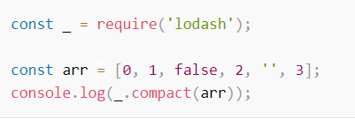
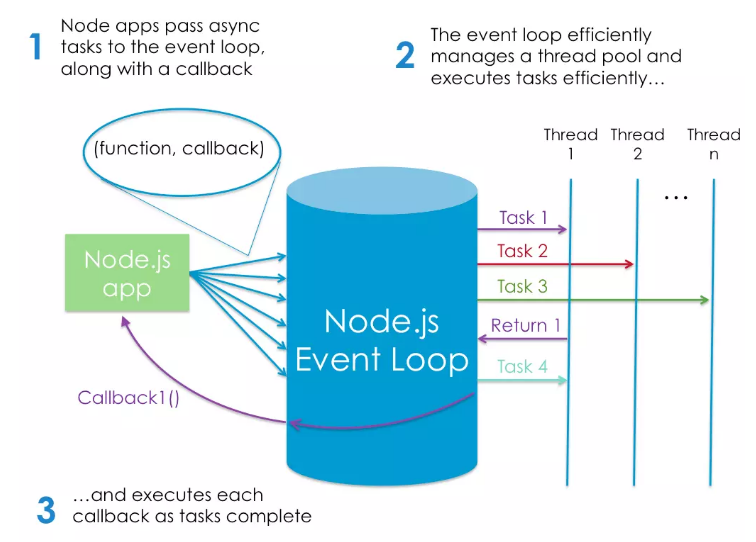

# What Is Node and When Should I Use It?

# What Is Node.js?
**Node Is Built on Google Chrome’s V8 JavaScript Engine**

[The V8 engine](https://v8.dev/) is the open-source JavaScript engine that runs in Google Chrome and other Chromium-based web browsers, including Brave, Opera, and Vivaldi. It was designed with performance in mind and is responsible for compiling JavaScript directly to native machine code that your computer can execute.
This means that Node.js is a program we can use to execute JavaScript on our computers. In other words, it’s a JavaScript runtime.

# How Do I Install Node.js?
use a version manager instead. This is a program that allows you to install multiple versions of Node and switch between them at will. There are various advantages to using a version manager. For example, it negates potential permission issues when using Node with npm and lets you set a Node version on a per-project basis.
You can check that Node is installed on your system by opening a terminal and typing node -v. If all has gone well, you should see something like v12.14.1 displayed. This is the current LTS version at the time of writing.

# Introducing npm, the JavaScript Package Manager
Node comes bundled with a package manager called npm. To check which version you have installed on your system, type npm -v.
In addition to being the package manager for JavaScript, npm is also the world’s largest software registry. There are over 1,000,000 packages of JavaScript code available to download, with billions of downloads per week. 

# Installing a Package Globally

Open your terminal and type the following:

    npm install -g jshint

This will install the jshint package globally on your system. We can use it to lint the **index.js** file from the previous example:

    jshint index.js

You should now see a number of ES6-related errors. If you want to fix them up, add /* jshint esversion: 6 */ to the top of the index.js file, re-run the command and linting should pass.

# Installing a Package Locally
We can also install packages locally to a project, as opposed to globally, on our system. Create a test folder and open a terminal in that directory. Next type this:

      npm init -y

This will create and auto-populate a package.json file in the same folder. Next, use npm to install the lodash package and save it as a project dependency:

      npm install lodash --save

Create a file named test.js and add the following:

Finally, run the script using node test.js. You should see [ 1, 2, 3 ] output to the terminal.

# Working with the package.json File
If you open the package.json file, you’ll see lodash listed under the dependencies field. By specifying your project’s dependencies in this way, you allow any developer anywhere to clone your project and use npm to install whatever packages it needs to run.

## What Is Node.js Used For?
These build tools come in all shapes and sizes, and you won’t get far in a modern JavaScript landscape without bumping into them. They can be used for anything from bundling your JavaScript files and dependencies into static assets, to running tests, or automatic code linting and style checking.

## The Node.js Execution Model

Node.js, however, is single-threaded. It’s also event-driven, which means that everything that happens in Node is in reaction to an event. For example, when a new request comes in (one kind of event) the server will start processing it. If it then encounters a blocking I/O operation, instead of waiting for this to complete, it will register a callback before continuing to process the next event. When the I/O operation has finished (another kind of event), the server will execute the callback and continue working on the original request. Under the hood, Node uses the libuv library to implement this asynchronous (that is, non-blocking) behavior.

Node’s execution model causes the server very little overhead, and consequently it’s capable of handling a large number of simultaneous connections. The traditional approach to scaling a Node app is to clone it and have the cloned instances share the workload. Node.js even has a built-in module to help you implement a cloning strategy on a single server.

# What Kind of Apps Is Node.js Suited To?
Node is particularly suited to building applications that require some form of real-time interaction or collaboration — for example, chat sites, or apps such as CodeShare, where you can watch a document being edited live by someone else. It’s also a good fit for building APIs where you’re handling lots of requests that are I/O driven (such as those needing to perform operations on a database), or for sites involving data streaming, as Node makes it possible to process files while they’re still being uploaded.

# What Are the Advantages of Node.js?
An often-touted advantage of using JavaScript on a web server — as well as in the browser — is that your brain no longer needs to switch modes. You can do everything in the same language, which, as a developer, makes you more productive (and hopefully, happier). For example, you can easily share code between the server and the client.

JSON is ideally suited for consumption by a JavaScript program, meaning that when you’re working with Node, data can flow neatly between layers without the need for reformatting. You can have one syntax from browser to server to database.

# Other Uses of Node

For example it can be used as a scripting language to automate repetitive or error prone tasks on your PC. It can also be used to write your own command line tool, such as this Yeoman-Style generator to scaffold out new projects.

Node.js can also can be used to build cross-platform desktop apps and even to create your own robots. What’s not to love?

    
