# Introduction to SQL

# What is SQL?

SQL, or Structured Query Language, is a language designed to allow both technical and non-technical users query, manipulate, and transform data from a relational database. And due to its simplicity, SQL databases provide safe and scalable storage for millions of websites and mobile applications.

# Relational databases
A relational database represents a collection of related (two-dimensional) tables. Each of the tables are similar to an Excel spreadsheet, with a fixed number of named columns (the attributes or properties of the table) and any number of rows of data.

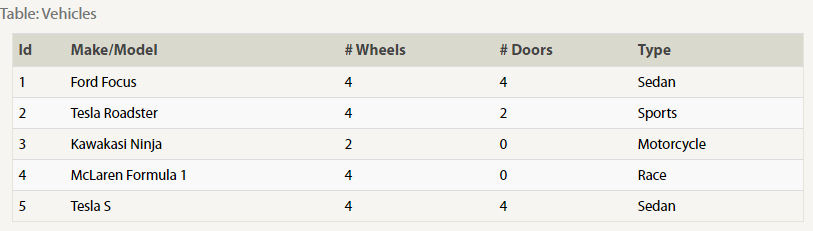

# SELECT queries 
o retrieve data from a SQL database, we need to write SELECT statements, which are often colloquially refered to as queries. A query in itself is just a statement which declares what data we are looking for, where to find it in the database, and optionally, how to transform it before it is returned. It has a specific syntax though

      **Select query for a specific columns**
          SELECT column, another_column, …
          FROM mytable;

The result of this query will be a two-dimensional set of rows and columns, effectively a copy of the table, but only with the columns that we requested.
If we want to retrieve absolutely all the columns of data from a table, we can then use the asterisk (*) shorthand in place of listing all the column names individually.

      Select query for all columns
        SELECT * 

# Queries with constraints 

In order to filter certain results from being returned, we need to use a WHERE clause in the query. The clause is applied to each row of data by checking specific column values to determine whether it should be included in the results or not.

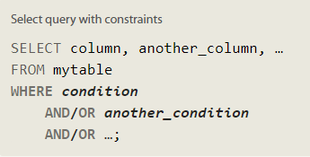

More complex clauses can be constructed by joining numerous AND or OR logical keywords (ie. num_wheels >= 4 AND doors <= 2). And below are some useful operators that you can use for numerical data (ie. integer or floating point):

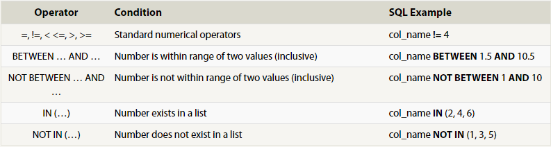

When writing WHERE clauses with columns containing text data, SQL supports a number of useful operators to do things like case-insensitive string comparison and wildcard pattern matching. We show a few common text-data specific operators below:

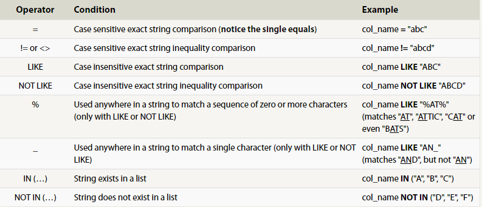

Here's the definition of a query with a WHERE clause again, go ahead and try and write some queries with the operators above to limit the results to the information we need in the tasks below.

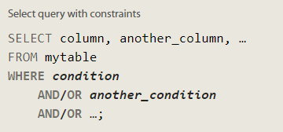

# Filtering and sorting Query results

Even though the data in a database may be unique, the results of any particular query may not be – take our Movies table for example, many different movies can be released the same year. In such cases, SQL provides a convenient way to discard rows that have a duplicate column value by using the DISTINCT keyword.

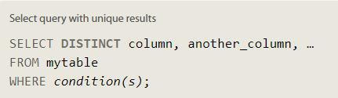

Since the DISTINCT keyword will blindly remove duplicate rows, we will learn in a future lesson how to discard duplicates based on specific columns using grouping and the GROUP BY clause.

## Ordering results
Unlike our neatly ordered table in the last few lessons, most data in real databases are added in no particular column order. As a result, it can be difficult to read through and understand the results of a query as the size of a table increases to thousands or even millions rows.
To help with this, SQL provides a way to sort your results by a given column in ascending or descending order using the ORDER BY clause.

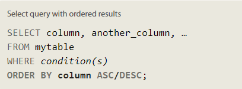

When an ORDER BY clause is specified, each row is sorted alpha-numerically based on the specified column's value. In some databases, you can also specify a collation to better sort data containing international text.

## Limiting results to a subset
Another clause which is commonly used with the ORDER BY clause are the LIMIT and OFFSET clauses, which are a useful optimization to indicate to the database the subset of the results you care about.
The LIMIT will reduce the number of rows to return, and the optional OFFSET will specify where to begin counting the number rows from.

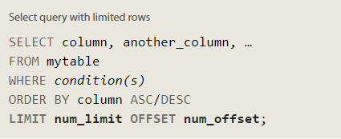

# Multi-table queries with JOINs

# Database normalization
Database normalization is useful because it minimizes duplicate data in any single table, and allows for data in the database to grow independently of each other (ie. Types of car engines can grow independent of each type of car). As a trade-off, queries get slightly more complex since they have to be able to find data from different parts of the database, and performance issues can arise when working with many large tables.

## Multi-table queries with JOINs

Using the JOIN clause in a query, we can combine row data across two separate tables using this unique key. The first of the joins that we will introduce is the INNER JOIN.

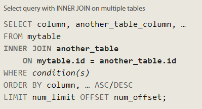

The INNER JOIN is a process that matches rows from the first table and the second table which have the same key (as defined by the ON constraint) to create a result row with the combined columns from both tables. After the tables are joined, the other clauses we learned previously are then applied.

## OUTER JOINs
Depending on how you want to analyze the data, the INNER JOIN we used last lesson might not be sufficient because the resulting table only contains data that belongs in both of the tables.
If the two tables have asymmetric data, which can easily happen when data is entered in different stages, then we would have to use a LEFT JOIN, RIGHT JOIN or FULL JOIN instead to ensure that the data you need is not left out of the results.

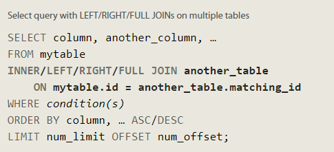

Like the INNER JOIN these three new joins have to specify which column to join the data on.
When joining table A to table B, a LEFT JOIN simply includes rows from A regardless of whether a matching row is found in B. The RIGHT JOIN is the same, but reversed, keeping rows in B regardless of whether a match is found in A. Finally, a FULL JOIN simply means that rows from both tables are kept, regardless of whether a matching row exists in the other table.

# A short note on NULLs

An alternative to NULL values in your database is to have data-type appropriate default values, like 0 for numerical data, empty strings for text data, etc. But if your database needs to store incomplete data, then NULL values can be appropriate if the default values will skew later analysis (for example, when taking averages of numerical data).

Sometimes, it's also not possible to avoid NULL values, as we saw in the last lesson when outer-joining two tables with asymmetric data. In these cases, you can test a column for NULL values in a WHERE clause by using either the IS NULL or IS NOT NULL constraint.

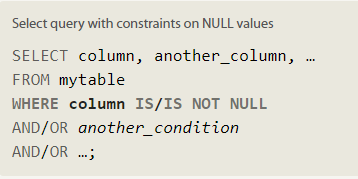

# Queries with expressions
 addition to querying and referencing raw column data with SQL, you can also use expressions to write more complex logic on column values in a query. These expressions can use mathematical and string functions along with basic arithmetic to transform values when the query is executed, as shown in this physics example.
 
 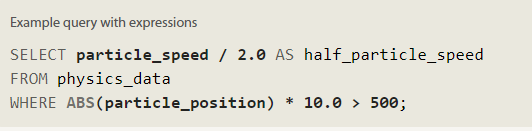
 
 The use of expressions can save time and extra post-processing of the result data, but can also make the query harder to read, so we recommend that when expressions are used in the SELECT part of the query, that they are also given a descriptive alias using the AS keyword.

 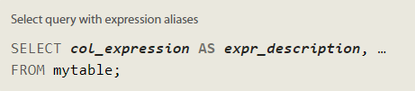
 

