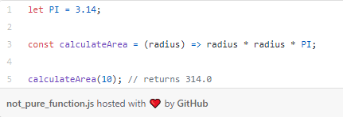
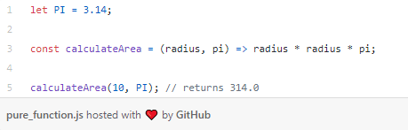
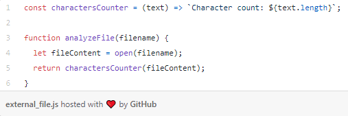
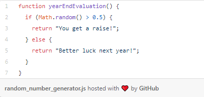
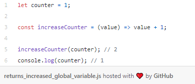
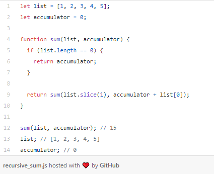
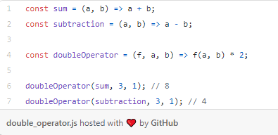
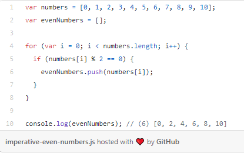
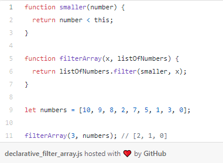

# Concepts of Functional Programming in Javascript

# What is functional programming?
Functional programming is a programming paradigm — a style of building the structure and elements of computer programs — that treats computation as the evaluation of mathematical functions and avoids changing-state and mutable data 

## pure functions
The first fundamental concept we learn when we want to understand functional programming is pure functions. But what does that really mean? What makes a function pure?

- **It returns the same result if given the same arguments**
Imagine we want to implement a function that calculates the area of a circle. An impure function would receive radius as the parameter, and then calculate radius * radius * PI:

Why is this an impure function? Simply because it uses a global object that was not passed as a parameter to the function.
Now imagine some mathematicians argue that the PI value is actually 42and change the value of the global object.
Our impure function will now result in 10 * 10 * 42 = 4200. For the same parameter (radius = 10), we have a different result. Let's fix it!

## Reading Files
If our function reads external files, it’s not a pure function — the file’s contents can change.

## Random number generation
Any function that relies on a random number generator cannot be pure.

- **It does not cause any observable side effects**
Examples of observable side effects include modifying a global object or a parameter passed by reference.
**Observation**: mutability is discouraged in functional programming.
We are modifying the global object. But how would we make it pure? Just return the value increased by 1. Simple as that.

Pure functions are stable, consistent, and predictable. Given the same parameters, pure functions will always return the same result. We don’t need to think of situations when the same parameter has different results — because it will never happen.

## Pure functions benefits

### Immutability
Unchanging over time or unable to be changed.
When data is immutable, its state cannot change after it’s created. If you want to change an immutable object, you can’t. Instead, you create a new object with the new value.

### Referential transparency
asically, if a function consistently yields the same result for the same input, it is referentially transparent.
        
        pure functions + immutable data = referential transparency
        
With this concept, a cool thing we can do is to memoize the function. 

### Functions as first-class entities
he idea of functions as first-class entities is that functions are also treated as values and used as data.
Functions as first-class entities can:

- refer to it from constants and variables
- pass it as a parameter to other functions
- return it as result from other functions

The idea is to treat functions as values and pass functions like data. This way we can combine different functions to create new functions with new behavior.

These functions have similar logic, but the difference is the operators functions. If we can treat functions as values and pass these as arguments, we can build a function that receives the operator function and use it inside our function. 

### Higher-order functions
When we talk about higher-order functions, we mean a function that either:

- takes one or more functions as arguments, or
- returns a function as its result

The doubleOperator function we implemented above is a higher-order function because it takes an operator function as an argument and uses it.
You’ve probably already heard about filter, map, and reduce. 

**Filter**
Given a collection, we want to filter by an attribute. The filter function expects a true or false value to determine if the element should or should not be included in the result collection. Basically, if the callback expression is true, the filter function will include the element in the result collection. Otherwise, it will not.

**Imperative approach**
An imperative way to do it with Javascript is to:

- create an empty array evenNumbers
- iterate over the numbers array
- push the even numbers to the evenNumbers array

**Declarative approach**
But we want a more declarative way to solve this problem, and using the filter higher order function as well.
A declarative Javascript solution would be something like this:

