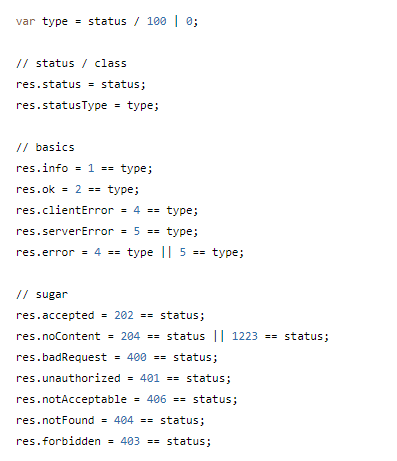

# Read: 01 - SMACSS and Responsive Web Design

Responsive web design is the practice of building a website suitable to work on every device and every screen size, no matter how large or small, mobile or desktop.

## Responsive vs. Adaptive vs. Mobile

Responsive and adaptive web design are closely related, and often transposed as one in the same.
Responsive generally means to react quickly and positively to any change, while adaptive means to be easily modified for a new purpose or situation, such as change. 
With responsive design websites continually and fluidly change based on different factors, such as viewport width, while adaptive websites are built to a group of preset factors. 

Currently the most popular technique lies within responsive web design, favoring design that dynamically adapts to different browser and device viewports,
changing layout and content along the way. This solution has the benefits of being all three, responsive, adaptive, and mobile.

## Flexible Layouts
Responsive web design is broken down into three main components, including **flexible layouts, media queries, and flexible media**. 
The first part, flexible layouts, is the practice of building the layout of a website with a flexible grid, capable of dynamically resizing to any width.
Flexible grids are built using relative length units, most commonly percentages or em units.
These relative lengths are then used to declare common grid property values such as width, margin, or padding.

Flexible layouts do not advocate the use of fixed measurement units, such as pixels or inches. Reason being, the viewport height and width continually change from device to device.

Website layouts need to adapt to this change and fixed values have too many constraints. Fortunately,
Ethan pointed out an easy formula to help identify the proportions of a flexible layout using relative values.
The formula is based around taking the target width of an element and dividing it by the width of it’s parent element. The result is the relative width of the target element.

           
        target ÷ context = result

