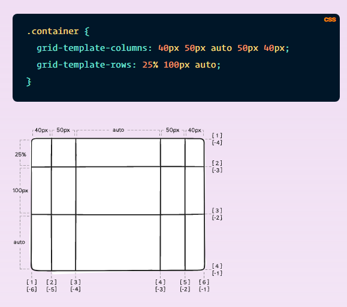

# Read: 01 - SMACSS and Responsive Web Design

Responsive web design is the practice of building a website suitable to work on every device and every screen size, no matter how large or small, mobile or desktop.

## Responsive vs. Adaptive vs. Mobile

Responsive and adaptive web design are closely related, and often transposed as one in the same.
Responsive generally means to react quickly and positively to any change, while adaptive means to be easily modified for a new purpose or situation, such as change. 
With responsive design websites continually and fluidly change based on different factors, such as viewport width, while adaptive websites are built to a group of preset factors. 

Currently the most popular technique lies within responsive web design, favoring design that dynamically adapts to different browser and device viewports,
changing layout and content along the way. This solution has the benefits of being all three, responsive, adaptive, and mobile.

## Flexible Layouts
Responsive web design is broken down into three main components, including **flexible layouts, media queries, and flexible media**. 
The first part, flexible layouts, is the practice of building the layout of a website with a flexible grid, capable of dynamically resizing to any width.
Flexible grids are built using relative length units, most commonly percentages or em units.
These relative lengths are then used to declare common grid property values such as width, margin, or padding.

Flexible layouts do not advocate the use of fixed measurement units, such as pixels or inches. Reason being, the viewport height and width continually change from device to device.

Website layouts need to adapt to this change and fixed values have too many constraints. Fortunately,
Ethan pointed out an easy formula to help identify the proportions of a flexible layout using relative values.
The formula is based around taking the target width of an element and dividing it by the width of it’s parent element. The result is the relative width of the target element.

           
        target ÷ context = result

## Media Queries

Media queries provide the ability to specify different styles for individual browser and device circumstances, the width of the viewport or device orientation for example.

### Initializing Media Queries

here are a couple different ways to use media queries, using the @media rule inside of an existing style sheet, importing a new style sheet using the @import rule, or by linking to a separate style sheet from within the HTML document. Generally speaking it is recommend to use the @media rule inside of an existing style sheet to avoid any additional HTTP requests.

Each media query may include a media type followed by one or more expressions. Common media types include all, screen, print, tv, and braille. 
The media query expression that follows the media type may include different media features and values, which then allocate to be true or false. When a media feature and value allocate to true, the styles are applied. If the media feature and value allocate to false the styles are ignored.

### Logical Operators in Media Queries
There are three different logical operators available for use within media queries, including **and, not, and only.**

Using the and logical operator within a media query allows an extra condition to be added, making sure that a browser or devices does both a, b, c, and so forth.

       @media all and (min-width: 800px) and (max-width: 1024px) {...}

The not logical operator negates the query, specifying any query but the one identified.
       
       @media not screen and (color) {...}

The only logical operator is a new operator and is not recognized by user agents using the HTML4 algorithm, thus hiding the styles from devices or browsers that don’t support media queries. 

       @media only screen and (orientation: portrait) {...}

## Flexible Media

One quick way to make media scalable is by using the max-width property with a value of 100%. Doing so ensures that as the viewport gets smaller any media will scale down according to its containers width.

      img, video, canvas {
           max-width: 100%;
           }
### Flexible Embedded Media
Unfortunately the max-width property doesn’t work well for all instances of media, specifically around iframes and embedded media. 
To get embedded media to be fully responsive, the embedded element needs to be absolutely positioned within a parent element. The parent element needs to have a width of 100% so that it may scale based on the width of the viewport. The parent element also needs to have a height of 0 to trigger the hasLayout mechanism within Internet Explorer.
Padding is then given to the bottom of the parent element, the value of which is set in the same aspect ratio of the video. This allows the height of the parent element to be proportionate to that of it’s width.

## What is “Float”?

Float is a CSS positioning property. It is commonly and appropriately called “text wrap”.

         #sidebar {
            float: right;			
           }

## What are floats used for?
floats can be used to create entire web layouts.

## Clearing the Float

Float’s sister property is clear. An element that has the clear property set on it will not move up adjacent to the float like the float desires, but will move itself down past the float.

In the above image, the sidebar is floated to the right and is shorter than the main content area. The footer then is required to jump up into that available space as is required by the float. To fix this problem, the footer can be cleared to ensure it stays beneath both floated columns.

        #footer {
             clear: both;			
           }

Clear has four valid values as well. **Both** is most commonly used, which clears floats coming from either direction. **Left and Right** can be used to only clear the float from one direction respectively. **None** is the default, which is typically unnecessary unless removing a clear value from a cascade. **Inherit** would be the fifth, but is strangely not supported in Internet Explorer. Clearing only the left or right float, while less commonly seen in the wild, definitely has its uses.

